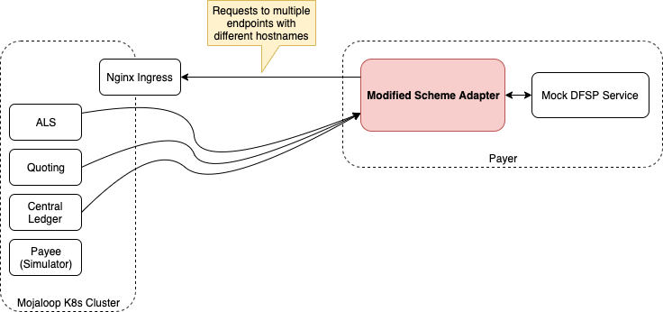

# SDK Scheme Adapter and Local K8S cluster testing

A detailed documentation for dfsps who want to test the mojaloop cluster deployment with scheme adapter and a mock backend service.



## Prerequisite

* A working mojaloop k8s cluster (Local / Cloud deployment)
* DFSP mock backend service
* Modified sdk-scheme-adapter & sdk-standard-components

## Configuration & Starting services

### Mojaloop Local K8S cluster deployment
Please follow the below link to deploy your own cluster on local system.
https://mojaloop.io/documentation/deployment-guide/
MacOS is recommended and atleast 16GB Ram and 4 core processor is required.

After installation please complete the New FSP Onboarding collection available at the below link.
https://github.com/mojaloop/postman

And make sure the oracles & endpoints are configured correctly and can able to run "Golden Path Collection" successfully.

### DFSP Mock Backend service
Please download the following repository
https://github.com/mojaloop/sdk-mock-dfsp-backend

Edit the docker-compose.yml file and add the port number to redis section to have it exposed.
```
    ports:
      - "6379:6379"
```
Edit the backend.env file and change the OUTBOUND_ENDPOINT to the following URL (Repalce the <MACHINE_IP>)
```
OUTBOUND_ENDPOINT=http://<MACHINE_IP>:4001
```

Start the backend and redis containers using the following command.
```
cd src
docker-compose up -d redis backend
```
Here we are not starting the scheme adapter in docker-compose file, beacuse we want to run our modified scheme adpater directly from another repo.

### Modified SDK Scheme adapter & SDK Standard Components
There are modifed versions of SDK scheme adapter and SDK standard component repos are available at the below links.
https://github.com/vijayg10/sdk-scheme-adapter
https://github.com/vijayg10/sdk-standard-components

Edit the package.json file in sdk-scheme-adapter and change the path of the sdk-standard-components in dependencies section.
```
"@mojaloop/sdk-standard-components": "^8.1.3"
 to 
"@mojaloop/sdk-standard-components": "file:../../sdk-standard-components/src"
```

Copy the "scheme_adapater_files/.env" file from this repo to src folder. Change the required configuration if needed.

Start the scheme adapter service using the following commands

```
cd src
node index.js
```

## Testing

### Additinal postman collections
Use the files "Mojaloop-Local.postman_environment_modified.json" and "OSS-Custom-FSP-Onboaring-SchemeAdapter-Setup.postman_collection.json" from the link below.
https://github.com/vijayg10/new-dfsp-onboarding-documentaion/tree/master/postman_files

Change URLs in the environment file to your machine IP where applicable.
By selecting the environment file please run the custom collection in the postman to provision a new FSP called "safsp".
The endpoints for safsp will be set to the URL of the scheme adapter which is configured in environment file.

### Try to send money
Try to send funds from "safsp" (Mock DFSP) to a MSISDN which is in "payeedfsp" (Simulator in K8S) through scheme adapter.
Run the following curl command to issue command to Mock DFSP service.
```
curl -X POST \
  http://localhost:3000/send \
  -H 'Content-Type: application/json' \
  -d '{
    "from": {
        "displayName": "John Doe",
        "idType": "MSISDN",
        "idValue": "123456789"
    },
    "to": {
        "idType": "MSISDN",
        "idValue": "27713803912"
    },
    "amountType": "SEND",
    "currency": "USD",
    "amount": "100",
    "transactionType": "TRANSFER",
    "note": "testpayment",
    "homeTransactionId": "123ABC"
}'
```

You should get a response with COMPLETED currentState.
