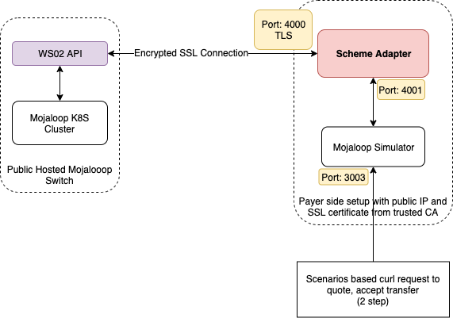

# SDK Scheme Adapter and WSO2 API Gateway

This documentaion is for testing scheme adapter against a public hosted WSO2 API gateway with SSL encryption and bearer token authentication.




## Prerequisite

* Accesss to WSO2 API production api with a generated token.
* sdk-scheme-adapter
* mojaloop-simulator

## Generate and get access token and URL from WSO2 API

## Arrange a public IP, DNS name and trusted SSL certificate

## Setting up Scheme Adapter with Mojaloop Simulator

Please download the Mojaloop Simulator repo
```
git clone https://github.com/mojaloop/mojaloop-simulator.git
```
* Generate the certicates by running the script "scripts/createSecrets.sh". This will generate certificates in src/secrets folder. Then replace the server cert, server key and ca cert from the above step.

  Incase of any certificate issues you may need to disable the "rejectUnauthorized" setting in "sdk-scheme-adapter" source code and re-build the docker image.
* Edit the file src/docker-compose.yml and change the required parameters. Please refer the following file.

    [mojaloop-simulator_files/docker-compose.yml](mojaloop-simulator_files/docker-compose.yml)
* Edit the file src/sim-backend.env file and change the container name of the scheme adapter in that. Please refer the following file.

    [mojaloop-simulator_files/sim-backend.env](mojaloop-simulator_files/sim-backend.env)
* Edit the file src/scheme-adapter.env and change the following settings
  ```
  MUTUAL_TLS_ENABLED=true
  CACHE_HOST=src_redis_1
  DFSP_ID=extpayerfsp
  BACKEND_ENDPOINT=src_sim_1:3000
  PEER_ENDPOINT=<Your WSO2 api url>
  AUTO_ACCEPT_QUOTES=true
  ```
  Please see the following file for your reference and add/change required lines if needed.

  [mojaloop-simulator_files/scheme-adapter.env](mojaloop-simulator_files/scheme-adapter.env)

  You may need to add the following line if there is no proper SSL certificate for WSO2 gateway.
  ```
  NODE_TLS_REJECT_UNAUTHORIZED=0
  ```

Then try running the following command to run the services
```
cd src/
docker-compose up -d
```

We can now access the mojaloop simulator's test api on 3003.

## Provision a new DFSP "extpayerfsp" with proper endpoints

## Send money
