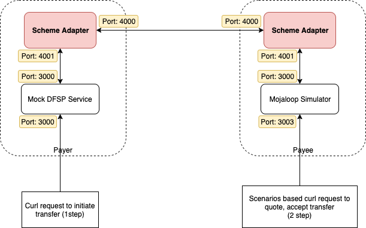

# Scheme Adapter to Scheme Adapter testing

A detailed documentation for dfsps who want to test the transfer of funds from a scheme adapter to another scheme adapter directly using mock backend and mojaloop simulator services.



## Prerequisite

* Mojaloop Simulator
* DFSP mock backend service
* Scheme adapter is already included in both the above docker-compose scripts

## Configuration & Starting services

The idea is to run two docker-compose scripts in parallel from the above two services. To avoid conflicts we need to edit the docker-compose.yml files and specify the container names.

### Mojaloop Simulator service

Please download the Mojaloop Simulator repo
```
git clone https://github.com/mojaloop/mojaloop-simulator.git
```
* Edit the file src/docker-compose.yml and add the container names for all the containers. Please refer the following file.

    [mojaloop-simulator_files/docker-compose.yml](mojaloop-simulator_files/docker-compose.yml)
* Edit the file src/sim-backend.env file and change the container name of the scheme adapter in that. Please refer the following file.

    [mojaloop-simulator_files/sim-backend.env](mojaloop-simulator_files/sim-backend.env)
* Edit the file src/scheme-adapter.env file and change the container names of the another scheme adapter and mojaloop simulator. And also add any missing configuration options from the following file.

    [mojaloop-simulator_files/scheme-adapter.env](mojaloop-simulator_files/scheme-adapter.env)

Then try running the following command to run the services
```
cd src/
docker-compose up -d
```

We can now access the mojaloop simulator's test api on 3003.

A new party should be added to the simulator using the following command. Feel free to change the details you want.
```
curl -X POST "http://localhost:3003/repository/parties" -H "accept: */*" -H "Content-Type: application/json" -d "{\"displayName\":\"Test Payee1\",\"firstName\":\"Test\",\"middleName\":\"\",\"lastName\":\"Payee1\",\"dateOfBirth\":\"1970-01-01\",\"idType\":\"MSISDN\",\"idValue\":\"9876543210\"}"
```

Then try to run the following command to check the new party added.
```
curl -X GET "http://localhost:3003/repository/parties" -H "accept: */*"
```

Let's move on to setup another instance of scheme adapter with DFSP mock backend.

### DFSP Mock Backend service

The DFSP mock backend is a minimal implementation of an example DFSP. Only basic functions are supported at the moment.

Please download the following repository
```
git clone https://github.com/mojaloop/sdk-mock-dfsp-backend.git
```

Edit the files src/docker-compose.yml, src/backend.env and src/scheme-adapter.env and add the container names for all the containers. Please refer the following files.

  [mock-dfsp_files/docker-compose.yml](mock-dfsp_files/docker-compose.yml)

  [mock-dfsp_files/backend.env](mock-dfsp_files/backend.env)


  [mock-dfsp_files/scheme-adapter.env](mock-dfsp_files/scheme-adapter.env)

Then try running the following command to run the services
```
cd src/
docker-compose up -d
```


## Try to send money
Try to send funds from "payerfsp" (Mock DFSP) to a MSISDN which is in "payeefsp" (Mojaloop Simulator) through scheme adapter.
Run the following curl command to issue command to Mock DFSP service.
```
curl -X POST \
  http://localhost:3000/send \
  -H 'Content-Type: application/json' \
  -d '{
    "from": {
        "displayName": "John Doe",
        "idType": "MSISDN",
        "idValue": "123456789"
    },
    "to": {
        "idType": "MSISDN",
        "idValue": "9876543210"
    },
    "amountType": "SEND",
    "currency": "USD",
    "amount": "100",
    "transactionType": "TRANSFER",
    "note": "test payment",
    "homeTransactionId": "123ABC"
}'
```

You should get a response with COMPLETED currentState.
